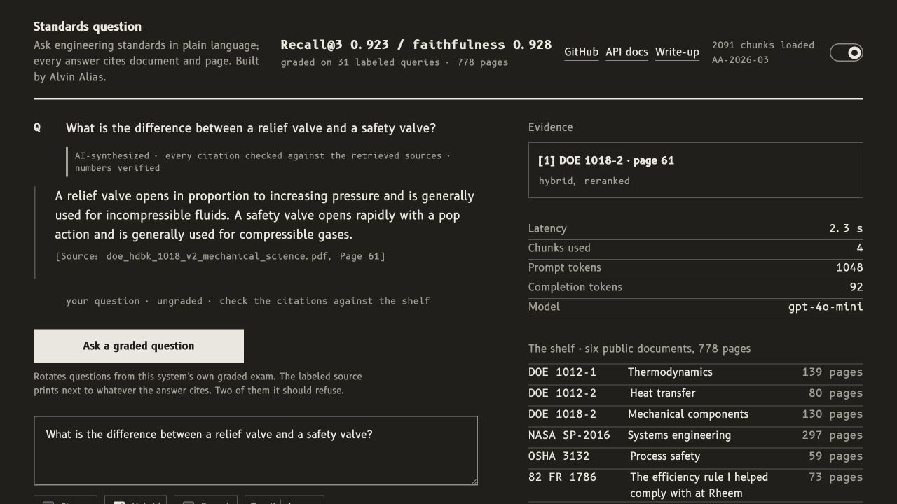
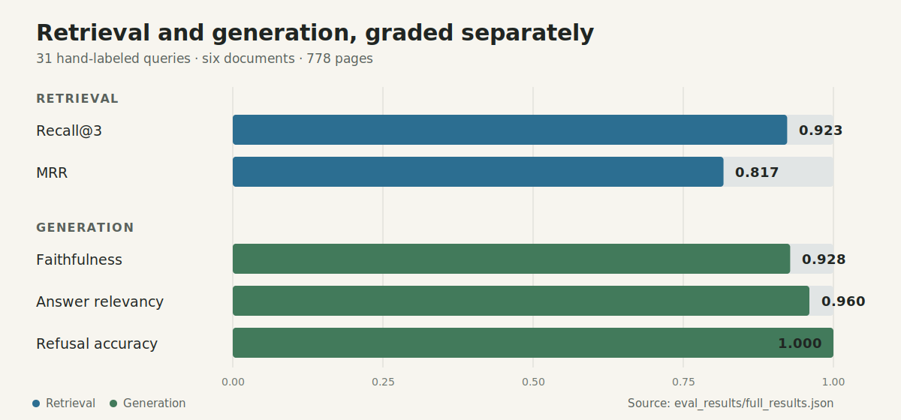

# RAG Engineering Assistant

Ask questions across 778 pages of DOE, NASA, OSHA, and Federal Register engineering documents. The system retrieves evidence, answers with page-level citations, and exposes the full retrieval trace in a custom review interface.

[](https://www.python.org/)
[](https://www.langchain.com/)
[](https://fastapi.tiangolo.com/)
[](https://github.com/aalias01/rag-engineering-assistant/actions/workflows/ci.yml)

> **TL;DR**
> - **What:** a citation-first RAG system with deterministic fact lookup, intent routing, and post-generation validation.
> - **Corpus:** six public engineering documents, 778 pages, 2,091 page-aware chunks.
> - **Measured:** Recall@3 0.923, faithfulness 0.928, answer relevancy 0.960, refusal accuracy 1.000.
> - **Live:** [app](https://rag.alvinalias.com) · [API docs](https://rag-engineering-assistant-api.onrender.com/docs) · [write-up](https://alvinalias.com/notes/posts/not-every-rag-query-needs-an-llm.html).
> - **Stack:** FastAPI, ChromaDB, OpenAI embeddings, Groq/OpenAI/Ollama generation, vanilla JS.





## 60-second tour

1. Open the [live demo](https://rag.alvinalias.com) and click **Ask a graded question**.
2. Read the route badge, cited answer, and labeled-source grade; the evidence rail shows the retrieved page, latency, tokens, and model.
3. Try an unrelated question. The system should decline instead of improvising beyond its six-document shelf.

The API runs on Render's free tier and may take 30–60 seconds to wake after inactivity. The header now reports that wake-up state, retries health checks every 10 seconds, and refreshes after a successful query.

## Why this project

Engineering search is only useful when a reviewer can verify the answer. I built the full path, from PDF ingestion and page-aware retrieval through evaluation, API, and frontend, around three trust requirements:

- Preserve document and page metadata from ingestion through the response.
- Grade retrieval separately from answer quality, including near-domain refusal traps.
- Show the evidence and validation result instead of hiding the system behind a chat box.

## System design

```text
PDFs -> page-aware chunks -> ChromaDB
                              ^
query -> intent router -------|
          |       |           |
          |       +-> interpret -> dense + BM25 -> RRF -> optional rerank
          |                                      -> cited LLM answer -> validator
          +-> lookup -> verified facts file -> templated cited answer (no LLM)
          +-> clarify -> follow-up question (no retrieval or LLM)
```

| Route | Mechanism | Failure direction |
|---|---|---|
| `factual_lookup` | Exact value, unit, quote, and page from verified JSON facts | Lookup miss falls through to synthesis |
| `synthesized` | Dense/BM25 retrieval, optional rerank, constrained generation, citation/number checks | Router failure reproduces the v1 path |
| `clarification` | Asks which stored value the user means | Avoids guessing between valid answers |

The facts files contain 88 verified values from OSHA 3132 and the 2017 DOE efficiency rule. The offline factual evaluation returns the correct value and page on 50 of 50 queries. See the [system card](docs/SYSTEM_CARD.md) for the full routing, validation, refusal, and provider behavior.

## Evaluation

The frozen set contains 21 in-corpus questions, five synthesis-heavy borderline questions, and five out-of-corpus traps. Published metrics come from `official_results` in [`eval_results/full_results.json`](eval_results/full_results.json).

| Metric | Result | Target |
|---|---:|---:|
| Retrieval Recall@3 | **0.923** | ≥ 0.85 |
| Retrieval MRR | **0.817** | ≥ 0.70 |
| Ragas faithfulness | **0.928** | ≥ 0.85 |
| Ragas answer relevancy | **0.960** | ≥ 0.85 |
| Refusal accuracy | **1.000** (5/5) | ≥ 0.80 |
| Median end-to-end latency | **2.31 s** | ≤ 3 s |

### Intent routing benchmark

The reviewed intent set contains 168 queries with a fixed 135/33 train and holdout split. GPT-4o-mini had the best point estimate, but the confidence intervals overlap because the holdout is small.

| Backend | Accuracy | Wilson 95% CI | Median latency |
|---|---:|---:|---:|
| Rules | 21/33 (63.6%) | 46.6% to 77.8% | 0 ms |
| Groq zero-shot | 29/33 (87.9%) | 72.7% to 95.2% | 330 ms |
| GPT-4o-mini zero-shot | **31/33 (93.9%)** | **80.4% to 98.3%** | 571 ms |
| Local DistilBERT + LoRA | 27/33 (81.8%) | 65.6% to 91.4% | 21 ms |

Production uses the Groq zero-shot classifier. GPT-4o-mini scored two more correct answers, but the confidence intervals overlap and the holdout is too small to establish a reliable advantage. Groq was faster in this run and avoids per-query classifier cost. If the call fails, routing falls back to deterministic rules.

### Which provider runs when

The production configuration uses Groq for intent classification and answer generation. OpenAI remains only for `text-embedding-3-small` retrieval embeddings.

| Query path | Groq calls | OpenAI calls |
|---|---|---|
| Verified fact lookup | 1 intent classification | None |
| Clarification | 1 intent classification | None |
| Synthesized answer | 1 intent classification + 1 answer generation | 1 query embedding |
| Health check | None | None |

GPT-4o-mini appears in the benchmark because it was evaluated as an alternative classifier. It is not the selected production classifier or generator. The `openai/gpt-oss-20b` model name shown by Groq identifies the hosted model; requests still go to Groq and use the Groq key.

### Retrieval ablation

| Configuration | Recall@3 | MRR | Mean latency |
|---|---:|---:|---:|
| Dense only | **0.923** | **0.817** | 0.25 s |
| BM25 only | 0.731 | 0.580 | **0.01 s** |
| Hybrid RRF | 0.885 | 0.774 | 0.23 s |
| Hybrid RRF + reranker | **0.923** | 0.741 | 0.74 s |

Dense-only retrieval matched the full hybrid-plus-reranker pipeline on Recall@3, ranked correct evidence earlier, and ran at roughly one-third of the latency. The API keeps hybrid retrieval and reranking available for comparison, while the free deployment can use the measured-equivalent, lower-memory path.

Evaluation details: [protocol](docs/evaluation_protocol.md) · [intent benchmark](docs/intent_benchmark.md) · [raw results](eval_results/full_results.json).

## Corpus

| Document | Pages | Domain |
|---|---:|---|
| DOE-HDBK-1012 Vol 1 | 139 | Thermodynamics |
| DOE-HDBK-1012 Vol 2 | 80 | Heat transfer |
| DOE-HDBK-1018 Vol 2 | 130 | Mechanical components |
| NASA SP-2016-6105 Rev 2 | 297 | Systems engineering |
| OSHA 3132 | 59 | Process safety |
| DOE Final Rule 82 FR 1786 | 73 | CAC/HP efficiency regulation |

Every source is public, and its provenance and inclusion rationale are documented in [`docs/corpus_selection.md`](docs/corpus_selection.md). The final rule is also the regulation behind a product-line redesign I led in industry.

## Run locally

<details>
<summary>Setup, ingest, test, and serve</summary>

```bash
git clone https://github.com/aalias01/rag-engineering-assistant
cd rag-engineering-assistant
conda env create -f environment.yml
conda activate rag-assistant
cp .env.example .env
```

Set `OPENAI_API_KEY` in `.env`, place public or license-compatible PDFs in `data/documents/`, then run:

```bash
python -m src.ingestion --reset
python scripts/smoke_test.py
python -m pip install -r requirements-dev.txt
pytest -q
uvicorn api.main:app --reload
```

Serve `frontend/` with a static server. `frontend/config.js` points local pages to `http://localhost:8000` and deployed pages to the Render API.

</details>

## Deployment and API

The frontend is deployed on Vercel and the FastAPI backend on Render. Production uses Groq's free tier for intent classification and generation. OpenAI `text-embedding-3-small` embeds only questions routed to retrieval. OpenAI and local Ollama generation remain selectable with `LLM_PROVIDER`. The committed Chroma collection lets the service start without ingesting documents during deploy.

- [API reference](docs/API.md)
- [Deployment runbook](docs/deployment_notes.md)
- [OpenAPI UI](https://rag-engineering-assistant-api.onrender.com/docs)
- [Health endpoint](https://rag-engineering-assistant-api.onrender.com/health)

## Project map

```text
api/            FastAPI routes, schemas, predictor orchestration
src/            ingestion, retrieval, generation, routing, facts, validation
data/           evaluation sets, intent labels, verified facts
evals/          Inspect AI factual, intent, and retrieval tasks
frontend/       custom evidence-review interface
docs/           system card, API, evaluation, corpus, deployment
eval_results/   committed measured outputs
tests/          unit and integration coverage
```

## Known limits

- The shelf is six documents; the system should decline questions outside it.
- The 31-query primary evaluation, 50-query factual set, and 33-query intent holdout are intentionally labeled but still small.
- Facts lookup is keyword matching; unfamiliar phrasing can fall through to the synthesized path.
- The validator's sentence-support check is token overlap, while Ragas faithfulness remains the finer offline measure.
- Scanned PDFs require OCR, and the Federal Register's three-column layout remains a difficult extraction case.
- The free Render service sleeps, and the cross-encoder is disabled there because its 512 MB memory budget is tight.

More detail: [`docs/SYSTEM_CARD.md`](docs/SYSTEM_CARD.md).

*Built by [Alvin Alias](https://github.com/aalias01) · MS Data Science, University of Washington · 12 years in HVAC, subsea, and manufacturing engineering*
